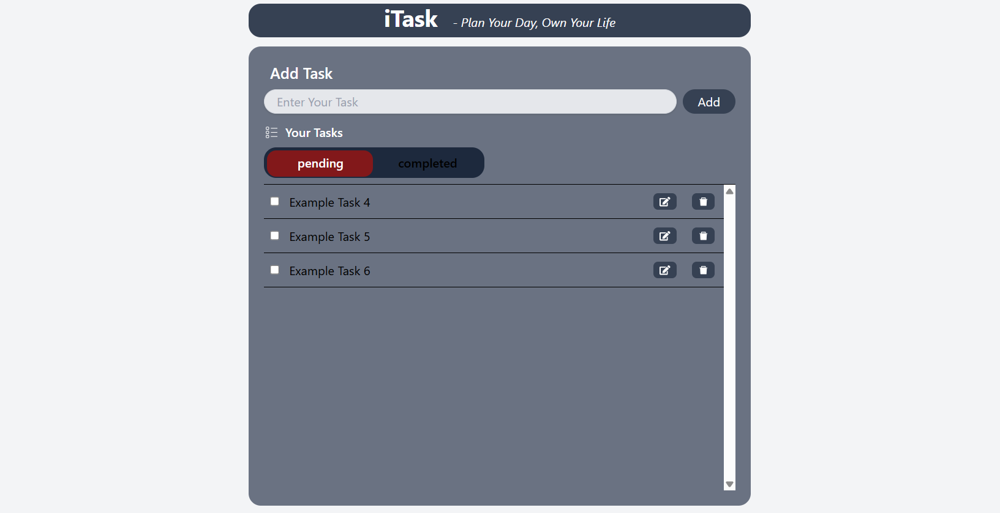
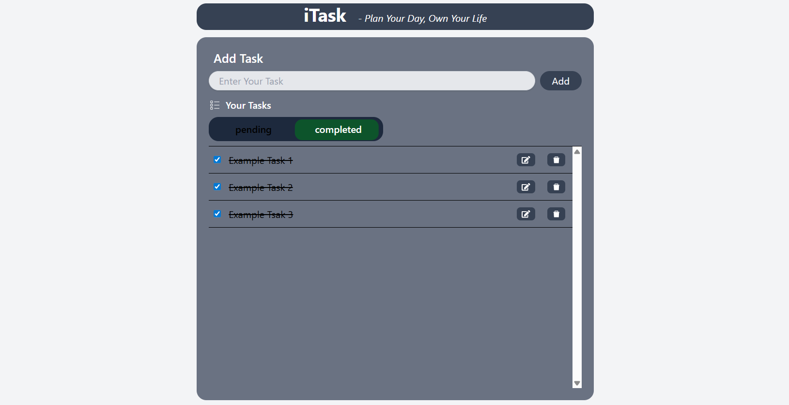

# 📝 iTask - Todo Manager

iTask is a simple and clean Todo Application built using React and Tailwind CSS.  
It helps users manage their daily tasks easily with features like adding, editing, deleting, and completing tasks.

---

## 🚀 Features

✅ Add new tasks  
✅ Edit existing tasks  
✅ Delete tasks  
✅ Mark tasks as completed  
✅ View Pending & Completed tasks separately  
✅ LocalStorage support (tasks stay saved after refresh)  
✅ Clean and responsive UI  

---

## 🛠️ Tech Stack

- React.js
- Tailwind CSS
- UUID
- LocalStorage

---

## 📸 Preview

<p align="center">
  
  
</p>

---

## 📂 Project Structure

```bash
src/
 ├── App.jsx
 ├── main.jsx
 ├── index.css

screenshots/
 ├── Pending.png
 ├── Complete.png
```

---

## ⚡ Installation

Clone the repository:

```bash
git clone YOUR_GITHUB_REPO_LINK
```

Go to project folder:

```bash
cd itask
```

Install dependencies:

```bash
npm install
```

Run development server:

```bash
npm run dev
```

---

## 🎯 What I Learned

While building this project, I learned:

- React Hooks (`useState`, `useEffect`)
- CRUD Operations
- LocalStorage Handling
- Conditional Rendering
- Dynamic UI Updates
- Tailwind CSS Styling
- State Management in React

---

## 🔮 Future Improvements

- 🌙 Dark Mode
- 📅 Due Dates
- 🔍 Task Search
- 🏷️ Categories & Priorities
- ☁️ Backend Integration
- 🔐 User Authentication

---

## 👨‍💻 Author

Made with by Jatin Prajapati